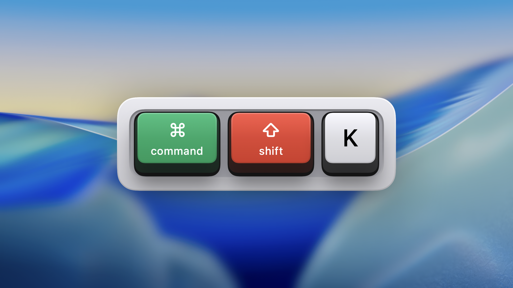
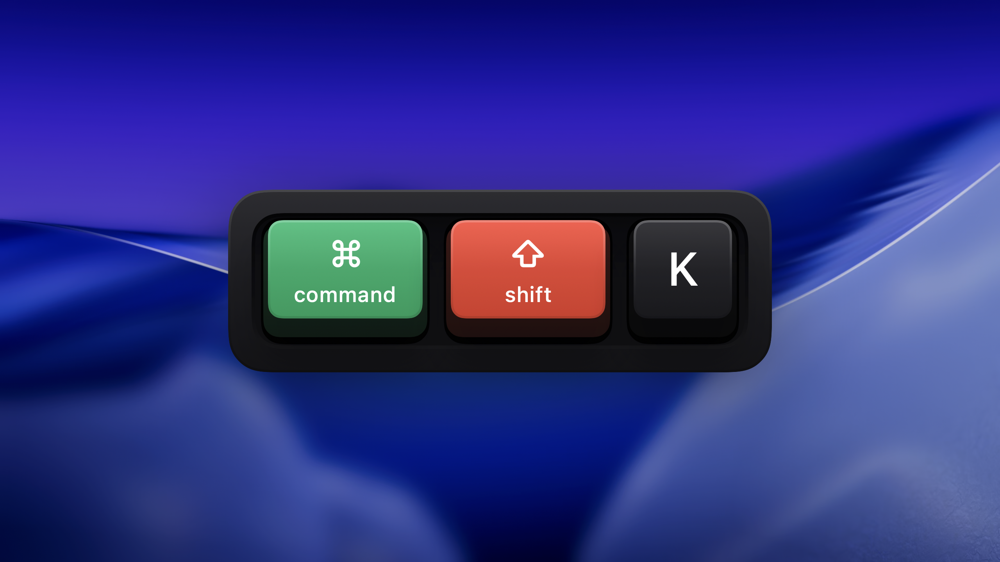

# Keypress

[](https://github.com/xkelxmc/keypress-macos/actions/workflows/ci.yml)
[](https://github.com/xkelxmc/keypress-macos/commits/main)
[](./LICENSE)
[](https://swift.org/)
[](https://www.apple.com/macos/)

A macOS menu bar app that visualizes keyboard input with beautiful skeuomorphic 3D mechanical key aesthetics.

<p align="center">
  
  
</p>

## Features

- 🎹 3 keycap styles: Mechanical (3D), Flat (modern), Minimal (compact)
- ✨ Press animation — keys visually respond to press/release
- 🌍 Keyboard layout support — works with Russian, German, and other layouts
- 🖥️ Multi-monitor support with auto-follow or fixed display
- 🌗 Auto light/dark mode (follows system)
- 🎨 Per-category color customization (10 key categories)
- 📍 8 preset positions with edge offset (up to 500×300px)
- ⌨️ Global hotkey to toggle visibility (default ⇧⌘K)
- 📺 Two display modes: Single (shortcuts) or History (typing)
- 🖱️ Click-through overlay — doesn't interfere with your work
- 🔄 Auto-updates via Sparkle
- 🎯 Perfect for content creators, demos, and screen sharing

## Requirements

- macOS 14+ (Sonoma)

## Install

### From Releases

Download the latest `.zip` from [Releases](https://github.com/xkelxmc/keypress-macos/releases).

### From Source

```bash
git clone https://github.com/xkelxmc/keypress-macos.git
cd keypress-macos
bun run start
```

## Development

```bash
# Dev loop — build, package, launch
bun run start

# With tests
bun run start:test

# Individual commands
bun run build          # Debug build
bun run build:release  # Release build
bun run test           # Run tests
bun run package        # Build Keypress.app
bun run stop           # Kill running instances

# Lint & format
bun run lint           # SwiftLint
bun run format         # SwiftFormat
bun run check          # Both
```

### Scripts

| Script | Description |
|--------|-------------|
| `Scripts/compile_and_run.sh` | Full dev loop: kill, build, package, launch |
| `Scripts/package_app.sh` | Build .app bundle |
| `Scripts/launch.sh` | Launch existing app (kill previous first) |
| `Scripts/build_icon.sh` | Generate Icon.icns from PNG |
| `Scripts/release.sh` | Full release workflow |
| `Scripts/sign-and-notarize.sh` | Sign and notarize for distribution |
| `Scripts/make_appcast.sh` | Generate Sparkle update feed |
| `Scripts/validate_changelog.sh` | Validate CHANGELOG before release |

## Documentation

- [CLAUDE.md](./CLAUDE.md) — Development guidelines for AI agents
- [docs/vision.md](./docs/vision.md) — Product vision
- [docs/features.md](./docs/features.md) — Feature specifications
- [docs/ui/](./docs/ui/) — UI design docs
- [docs/technical/](./docs/technical/) — Architecture and tech details
- [docs/icon.md](./docs/icon.md) — App icon source and build instructions

## Tech Stack

- Swift 6 with strict concurrency
- SwiftUI + AppKit
- Swift Package Manager
- Sparkle for auto-updates
- KeyboardShortcuts for global hotkeys

## License

MIT — see [LICENSE](./LICENSE)
