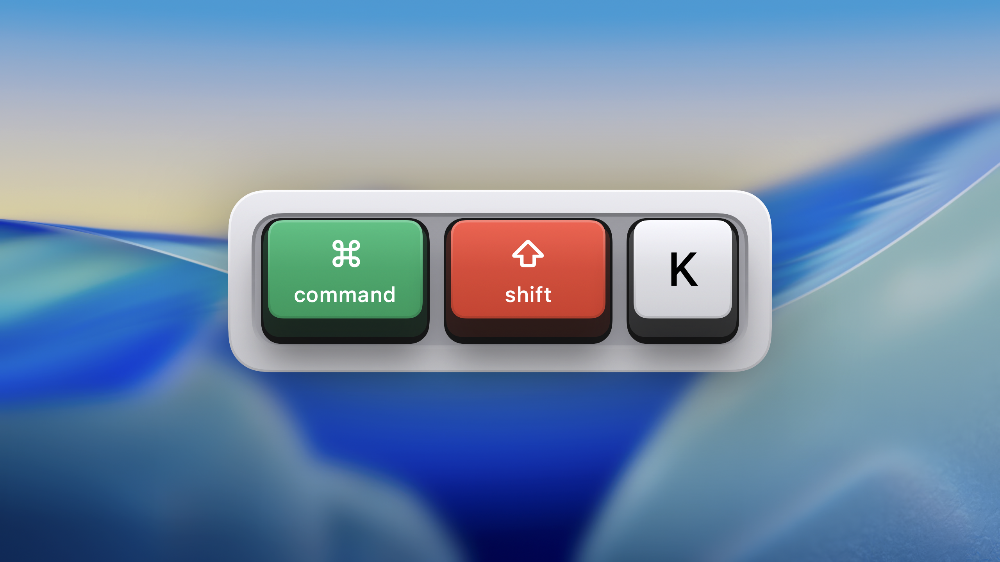
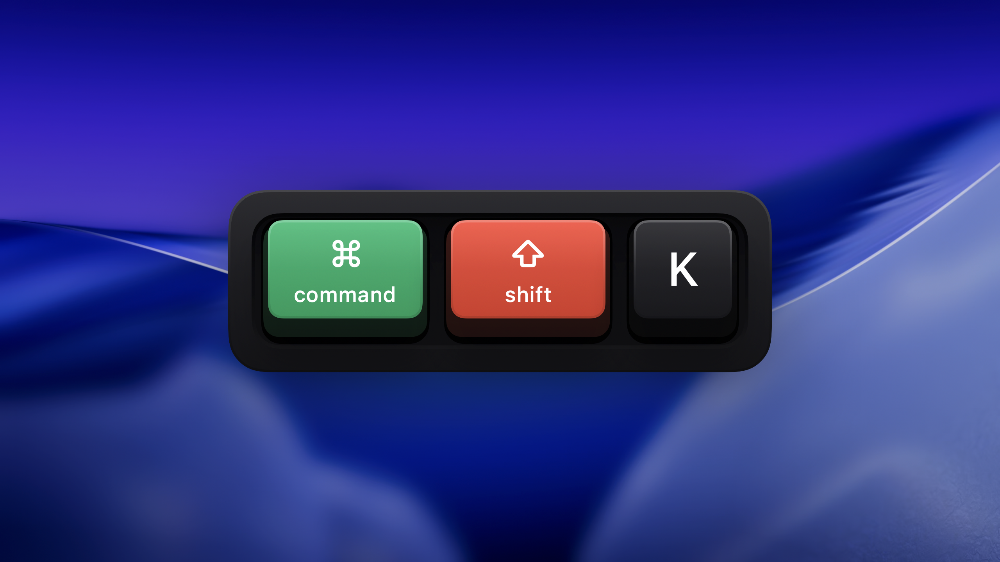

# Show KeyPress

[](https://apps.apple.com/app/id6792384936)
[](https://github.com/xkelxmc/keypress-macos/actions/workflows/ci.yml)
[](https://github.com/xkelxmc/keypress-macos/commits/main)
[](./LICENSE)
[](https://swift.org/)
[](https://www.apple.com/macos/)

A macOS menu bar app that visualizes keyboard input with beautiful skeuomorphic 3D mechanical key aesthetics.

<sub>Mac App Store name **Show KeyPress** · repository `keypress-macos` · bundle `Keypress.app`</sub>

<p align="center">
  
  
</p>

## Features

- 🎹 3 keycap styles: Mechanical (3D), Flat (modern), Minimal (compact)
- ✨ Press animation — keys visually respond to press/release
- 🌍 Keyboard layout support — works with Russian, German, and other layouts
- 🖥️ Multi-monitor support with auto-follow or fixed display
- 🌗 Auto light/dark mode (follows system)
- 🎨 Per-category color customization (10 key categories)
- 📍 8 preset positions with edge offset (up to 500×300px)
- ⌨️ Global hotkey to toggle visibility (default ⇧⌘K)
- 📺 Two display modes: Single (shortcuts) or History (typing)
- 🖱️ Click-through overlay — doesn't interfere with your work
- 🎯 Perfect for content creators, demos, and screen sharing

## Requirements

- macOS 14+ (Sonoma)

## Install

### Mac App Store

[**Show KeyPress on the Mac App Store**](https://apps.apple.com/app/id6792384936)

### From Source

Building Show KeyPress yourself is permitted for the purposes the license
allows — see [License](#license).

```bash
brew install xcodegen
git clone https://github.com/xkelxmc/keypress-macos.git
cd keypress-macos
bun run start
```

## Development

```bash
# Dev loop — build, package, launch
bun run start

# With tests
bun run start:test

# Individual commands
bun run build          # Debug build
bun run build:release  # Release build
bun run test           # Run tests
bun run package        # Build Keypress.app
bun run stop           # Kill running instances

# Lint & format
bun run lint           # SwiftLint
bun run format         # SwiftFormat
bun run check          # Both
```

### Scripts

| Script | Description |
|--------|-------------|
| `Scripts/compile_and_run.sh` | Full dev loop: kill, build, package, launch |
| `Scripts/package_app.sh` | Build Keypress.app via the generated Xcode project |
| `Scripts/launch.sh` | Launch existing app (kill previous first) |
| `Scripts/build_icon.sh` | Generate Icon.icns from PNG |
| `Scripts/release.sh` | Cut a release (tag + push, CI uploads to App Store Connect) |
| `Scripts/build_appstore.sh` | Xcode archive + export: sandboxed universal .pkg for the App Store |
| `Scripts/upload_appstore.sh` | Validate and upload .pkg to App Store Connect |
| `Scripts/validate_changelog.sh` | Validate CHANGELOG before release |

## Documentation

- [CLAUDE.md](./CLAUDE.md) — Development guidelines for AI agents
- [docs/vision.md](./docs/vision.md) — Product vision
- [docs/features.md](./docs/features.md) — Feature specifications
- [docs/ui/](./docs/ui/) — UI design docs
- [docs/technical/](./docs/technical/) — Architecture and tech details
- [docs/icon.md](./docs/icon.md) — App icon source and build instructions

## Tech Stack

- Swift 6 with strict concurrency
- SwiftUI + AppKit
- Swift Package Manager
- KeyboardShortcuts for global hotkeys

## Contributing

Bug reports and feature requests are welcome. Pull requests require agreeing to
the contributor terms — see [CONTRIBUTING.md](./CONTRIBUTING.md).

## License

> **Bought the app? This does not apply to you.** The terms below cover only
> the source code in this repository. Show KeyPress places no restriction on
> using the app you bought commercially — paid screencasts, streams, courses,
> and client work are all fine. Your copy from the Mac App Store is licensed
> under Apple's standard Licensed Application End User License Agreement.

**Source-available, not open source.** The source of Show KeyPress is licensed
under the [PolyForm Strict License 1.0.0](./LICENSE), plus the Additional
Permissions stated in that file.

It is public so that anyone can audit what an app holding Input Monitoring
permission actually does with keystrokes. It is not free to redistribute —
Show KeyPress is a paid app on the Mac App Store.

| Source code                                        |     |
| -------------------------------------------------- | --- |
| Read and audit it, business or not                  | ✅  |
| Build and run it for personal or hobby use          | ✅  |
| Use it in a charity, school, or government body     | ✅  |
| Modify it and fork it to prepare a pull request     | ✅  |
| Use it commercially, or as a work tool in a company  | ❌  |
| Redistribute it, source or binary                   | ❌  |
| Publish modified versions or derived works, outside a pull-request fork | ❌  |

Releases up to and including `v1.1.0-build.9` were published under the MIT
License and remain available under those terms — see [NOTICE.md](./NOTICE.md),
which also lists third-party attributions.
